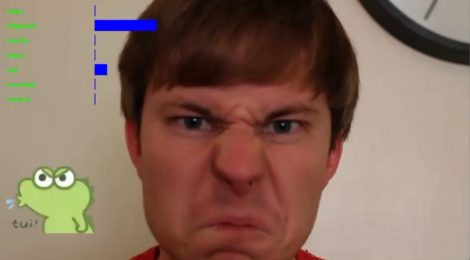

# 深度学习小组作业 

1. ### 各模型的准确率
   
  - #### CNN (with attention):53.2600%
  - #### DeepNN (with attention):56.3806%
  - #### ResNet (with attention):59.2000%
  - #### mini_XCEPTION (with attention):58.4291%
  - #### VGG (with attention):24.7144% 呜呜呜~~~（猜测是模型本身写的有问题）
2.  ### 演示截图
 
  - #### 开心
    
  - #### 惊讶
    
  - #### 厌恶
    
  - #### 中立
    
  - #### 生气
    
  - #### 伤心
    
4.  ### 如何训练、测试以及应用

```pyhton 
   parser = argparse.ArgumentParser(description='Fer2013 Emotion Recognition')
   parser.add_argument('--model', type=str, default='CNN', help='Model to use: CNN, VGG, ResNet, mini_XCEPTION, and Attention~')
   parser.add_argument('--mode', type=str, default='train', help='Mode: train, test, demo')
   parser.add_argument('--optimizer', type=str, default='adam', help='Optimizer: sgd, adam, rmsprop')
   parser.add_argument('--loss', type=str, default='cross_entropy', help='Loss function: cross_entropy, mse')
   parser.add_argument('--lr', type=float, default=0.001, help='Learning rate')
   parser.add_argument('--epochs', type=int, default=10, help='Number of epochs')
   parser.add_argument('--batch_size', type=int, default=64, help='Batch size')
   args = parser.parse_args()
```
    
   **示例：**
           **若想训练/测试/演示某个模型，在终端输入类似指令即可**
```pyhton
   python main.py --mode train --model AttentionCNN --epochs 20 --lr 0.0015
```
```python
   python main.py --mode test --model AttentionCNN
```
```python      
   python main.py --mode demo --model AttentionCNN
```   
5. ### 列表里的一些东西
  
  - #### CNNepoch_1.phg：训练时每个Epoch的loss曲线
  - #### checkpoint：训练时，每个模型最好的模型参数
  - #### data/emojis：demo中显示的表情（抹茶旦旦）
  - #### data/test && data/train：测试集和训练集（里面包括验证集）
  - #### data/video：demo中的视频 
6. ### 函数说明

  - #### demo：演示代码
  - #### main：主函数
  - #### train && test && model：训练模型、测试模型、五个需要训练的模型
  - #### haarcascade_frontalface_default.xml：OpenCv中检测人脸的模型
  - #### Csv_to_Image：将fer2013.csv里的内容转换为Image


    
